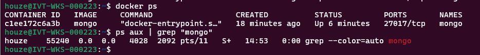
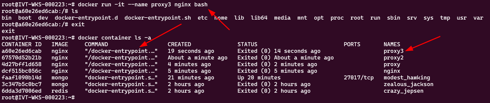

Docker image
Docker container
Docker registry

## 1. The build-ship-run idea

- CNCF is cloud native computing foundation
- Container image: a universal app packager
- Cross platform
- Docker file
- OCI is an image standard
- Stacking up the layers
- Image registry & app distribution (Docker hub)
- Sha hash is generated by the image we build

---
docker container
docker engine 是一层虚拟化层

`docker run my-python-app`会允许在docker container中执行某些命令，这类似于namespace，让程序看不见其他的系统环境，会给进程提供自己的文件系统，process list，以及网络，like its own system
你可以多次执行相同的`docker run`，

those two process are isolated from each other

## 2. Moby docker whale

? what is TCP/TLS
docker client 和 docker engine之间的沟通可以通过各种传输协议来进行通讯

engine版本的查看
`docker version`
`docker info`                               more details

image的创建
`docker build`

image镜像的拉取和上传
`docker push` the image on the image registry
`docker pull` the image from the image registry

容器监控
`docker ps`                                 展示正在运行的容器
`docker container ls -a`                    展示所有容器（包括被stop的）
`docker container logs <container_name>`    展示日志
`docker container top <container_name>`     展示运行的进程

`docker container inspect <container_name>`
`docker container stats`

容器创建（启动）/删除/
`docker run -d -p 8800:80 httpd`            `-d` means detach       -p allow to publish a container's port to host
端口转发语法：`<host_port>:<container_port>`
`docker run`的时候，先会下载镜像，然后创建容器，将镜像中的内容拷贝到容器里，最后再启动进程
`docker start`                              开启容器
`docker container stop <container_ID>`
`docker container rm -f <container_name>`   强制删除（就算在运行也会删除）

---

关于宿主机使用`ps aux`指令无法观察容器进程的问题

.png>)

Getting a shell inside a container 你不再需要使用ssh去切进容器，宿主机对容器有绝对的控制权
`docker run -it`                            -t sudo-tty

让nginx的启动command变成bash
```bash
root@IVT-WKS-000223:~# docker container run -it --name proxy nginx bash
root@4d27bff1d658:/#
root@4d27bff1d658:/#
root@4d27bff1d658:/# ps
bash: ps: command not found
```

`docker container start -ai <container_name>`                   在关闭容器后重启容器，并进入该容器的cmd
`docker container exec -it <container_name> <command(bash)>`    在运行的容器中开一个bash进程

不知道是什么原因错咯，无法复现
