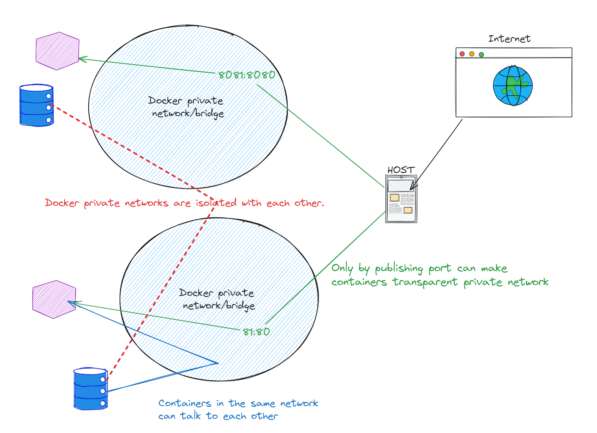

Docker image
Docker container
Docker registry

## 1. Introduction

- CNCF is cloud native computing foundation
- Container image: a universal app packager
- Cross platform
- Docker file
- OCI is an image standard
- Stacking up the layers
- Image registry & app distribution (Docker hub)
- Sha hash is generated by the image we build

---
- docker container
- docker engine
一层虚拟化层，如果不开这个engine，wsl中就无法使用docker
```bash
root@IVT-WKS-000223:~# docker

The command 'docker' could not be found in this WSL 2 distro.
We recommend to activate the WSL integration in Docker Desktop settings.

For details about using Docker Desktop with WSL 2, visit:

https://docs.docker.com/go/wsl2/
```

`docker run my-python-app`会允许在docker container中执行某些命令，这类似于namespace，让程序看不见其他的系统环境，会给进程提供自己的文件系统，process list，以及网络，like its own system
你可以多次执行相同的`docker run`，

those two process are isolated from each other

## 4 Play the containers as a boss
### 4.1 容器的启动和关闭
? what is TCP/TLS
docker client 和 docker engine之间的沟通可以通过各种传输协议来进行通讯

engine版本的查看
`docker version`
`docker info`                               more details

image的创建
`docker build`

image镜像的拉取和上传
`docker push` the image on the image registry
`docker pull` the image from the image registry

容器监控
`docker ps`                                 展示正在运行的容器
`docker container ls -a`                    展示所有容器（包括被stop的）
`docker container logs <container_name>`    展示日志
`docker container top <container_name>`     展示运行的进程

`docker container inspect <container_name>`
`docker container stats`

容器创建（启动）/删除/
`docker run -d -p <host_port>:<container_port> <container_name>`    `-d` means detach   -p publish
`docker run`的时候，先会下载镜像，然后创建容器，将镜像中的内容拷贝到容器里，最后再启动进程
`docker start`                              开启容器
`docker container stop <container_ID>`
`docker container rm -f <container_name>`   强制删除（就算在运行也会删除）

#### 进程监控issue
关于宿主机使用`ps aux`指令无法观察容器进程的问题

.png>)

Getting a shell inside a container 你不再需要使用ssh去切进容器，宿主机对容器有绝对的控制权
`docker run -it`                            -t sudo-tty

让nginx的启动command变成bash
```bash
root@IVT-WKS-000223:~# docker container run -it --name proxy nginx bash
root@4d27bff1d658:/#
root@4d27bff1d658:/#
root@4d27bff1d658:/# ps
bash: ps: command not found
```

`docker container start -ai <container_name>`                   在关闭容器后重启容器，并进入该容器的cmd
`docker container exec -it <container_name> <command(bash)>`    在运行的容器中开一个bash进程
`docker container run --rm -it ...`                             在容器关闭后删除该容器

不知道是什么原因错咯，无法复现


### 4.2 网络管理
Best practice is to create a new virtual network for each app.

`docker run -d -p <host_port>:<container_port> <container_name>`    `-d` means detach   -p publish
`docker container port <container>`                             查看容器端口
`docker container inspect --format '{{ .NetworkSettings.IPAddress }}' <container_name>`     查看容器的ip地址
容器的ip地址和宿主机的ip地址是不一样的

Microservices cannot rely on IP addresses, ...
Too dynamic and too flexible, ...
Docker 在微服务的场景下一般使用container names来进行通讯，而不是IP地址

`docker network ls`                     
`docker network insepct <network_name>`             查看某一private network中有的container
`docker network create --driver`        创建网络
`docker network connect/disconnect`     类似于将网卡插入container

### 4.3 解析Docker子网
```bash
root@IVT-WKS-000223:/mnt/c/Users/hzhang3/Documents/HouzeZHANG.github.io/content/posts/Docker# docker network ls
NETWORK ID     NAME      DRIVER    SCOPE
a97a74aca4ff   bridge    bridge    local
9c8654069879   host      host      local
efd7f1376d1b   none      null      local
```
- `bridge` network is the default private(virtual) network created by the docker.
- `host` network用于跳过Virtual network，让容器直接和物理interface进行通信，在某些情况下能够降低throughput时延，only in certain situations...
- `none` network意味着有这么一个网络，但是什么也没有接。

```bash
root@IVT-WKS-000223:/mnt/c/Users/hzhang3/Documents/HouzeZHANG.github.io/content/posts/Docker# docker network inspect bridge
[
    {
        "Name": "bridge",
        "Id": "a97a74aca4ff2f7d0e4b154c84a7974001449a7ba41899800dfd0e40bf5083fe",
        "Created": "2024-03-18T09:00:33.692926496Z",
        "Scope": "local",
        "Driver": "bridge",
        "EnableIPv6": false,
        "IPAM": {
            "Driver": "default",
            "Options": null,
            "Config": [
                {
                    "Subnet": "172.17.0.0/16",
                    "Gateway": "172.17.0.1"
                }
            ]
        },
        "Internal": false,
        "Attachable": false,
        "Ingress": false,
        "ConfigFrom": {
            "Network": ""
        },
        "ConfigOnly": false,
        "Containers": {
            "4d27bff1d6585a4df180e9353100dfeecd8400ec8c5c206e6e8980125d42e0a1": {
                "Name": "proxy",
                "EndpointID": "0eb7658914853f0431c184e7b22aac887a63b72bade35d6a51cf0f9e8fb3c65f",
                "MacAddress": "02:42:ac:11:00:02",
                "IPv4Address": "172.17.0.2/16",
                "IPv6Address": ""
            }
        },
        "Options": {
            "com.docker.network.bridge.default_bridge": "true",
            "com.docker.network.bridge.enable_icc": "true",
            "com.docker.network.bridge.enable_ip_masquerade": "true",
            "com.docker.network.bridge.host_binding_ipv4": "0.0.0.0",
            "com.docker.network.bridge.name": "docker0",
            "com.docker.network.driver.mtu": "1500"
        },
        "Labels": {}
    }
]
```

观察其中的`IPAM`项，这是所有容器默认的子网地址，以及默认网关，这个网关用于和实际的physical network进行通讯
```bash
"IPAM": {
    "Driver": "default",
    "Options": null,
    "Config": [
        {
            "Subnet": "172.17.0.0/16",
            "Gateway": "172.17.0.1"
        }
    ]
},
```

自己创建的新子网会默认使用bridge driver，总之driver是一个extension，是一个built-in或3rd party extension that gives you virtual network features
```bash
root@IVT-WKS-000223:/mnt/c/Users/hzhang3/Documents/HouzeZHANG.github.io/content/posts/Docker# docker network create my_app_net
306419ab57360f6f6f671741254b2c7b7d8e7c257c281bcc7bc9d81cacb8e6d3
root@IVT-WKS-000223:/mnt/c/Users/hzhang3/Documents/HouzeZHANG.github.io/content/posts/Docker# docker network ls
NETWORK ID     NAME         DRIVER    SCOPE
a97a74aca4ff   bridge       bridge    local
9c8654069879   host         host      local
306419ab5736   my_app_net   bridge    local
efd7f1376d1b   none         null      local
```

使用`--network`来在某个`subnet`中启动container
```bash
root@IVT-WKS-000223:/mnt/c/Users/hzhang3/Documents/HouzeZHANG.github.io/content/posts/Docker# docker run -d --name subnet_nginx --network my_app_net nginx
c13a94d07a5777cc359f2250f7fab36417d20cd9328ab338718c194756872c63
root@IVT-WKS-000223:/mnt/c/Users/hzhang3/Documents/HouzeZHANG.github.io/content/posts/Docker# docker network inspect my_app_net
[
    {
        "Name": "my_app_net",
        "Id": "306419ab57360f6f6f671741254b2c7b7d8e7c257c281bcc7bc9d81cacb8e6d3",
        "Created": "2024-03-18T09:43:33.052883345Z",
        "Scope": "local",
        "Driver": "bridge",
        "EnableIPv6": false,
        "IPAM": {
            "Driver": "default",
            "Options": {},
            "Config": [
                {
                    "Subnet": "172.18.0.0/16",
                    "Gateway": "172.18.0.1"
                }
            ]
        },
        "Internal": false,
        "Attachable": false,
        "Ingress": false,
        "ConfigFrom": {
            "Network": ""
        },
        "ConfigOnly": false,
        "Containers": {
            "c13a94d07a5777cc359f2250f7fab36417d20cd9328ab338718c194756872c63": {
                "Name": "subnet_nginx",
                "EndpointID": "258ad79511c43d7117b70d21277b205962a51304c44826cd1ed3e43cfcda9409",
                "MacAddress": "02:42:ac:12:00:02",
                "IPv4Address": "172.18.0.2/16",
                "IPv6Address": ""
            }
        },
        "Options": {},
        "Labels": {}
    }
]
```

一个container可以连接多个subnet，将某个container连接到某个subnet，在使用`docker network connect`之后，查看目标容器会发现多了一个network，且这俩端口的ip地址是不同的，新的subnet的网络地址是由DHCP分配的
```bash
root@IVT-WKS-000223:/mnt/c/Users/hzhang3/Documents/HouzeZHANG.github.io/content/posts/Docker# docker container inspect 4d27bff1d6585a4df180e9353100dfeecd8400ec8c5c206e6e8980125d42e0a1
...
        "NetworkSettings": {
            "Bridge": "",
            "SandboxID": "1e7e23b5f3e927f7de0d07615cb8506b1848fdb5ae33ade6e03f6cb40706217c",
            "SandboxKey": "/var/run/docker/netns/1e7e23b5f3e9",
            "Ports": {
                "80/tcp": null
            },
            "HairpinMode": false,
            "LinkLocalIPv6Address": "",
            "LinkLocalIPv6PrefixLen": 0,
            "SecondaryIPAddresses": null,
            "SecondaryIPv6Addresses": null,
            "EndpointID": "0eb7658914853f0431c184e7b22aac887a63b72bade35d6a51cf0f9e8fb3c65f",
            "Gateway": "172.17.0.1",
            "GlobalIPv6Address": "",
            "GlobalIPv6PrefixLen": 0,
            "IPAddress": "172.17.0.2",
            "IPPrefixLen": 16,
            "IPv6Gateway": "",
            "MacAddress": "02:42:ac:11:00:02",
            "Networks": {
                "bridge": {
                    "IPAMConfig": null,
                    "Links": null,
                    "Aliases": null,
                    "MacAddress": "02:42:ac:11:00:02",
                    "NetworkID": "a97a74aca4ff2f7d0e4b154c84a7974001449a7ba41899800dfd0e40bf5083fe",
                    "EndpointID": "0eb7658914853f0431c184e7b22aac887a63b72bade35d6a51cf0f9e8fb3c65f",
                    "Gateway": "172.17.0.1",
                    "IPAddress": "172.17.0.2",
                    "IPPrefixLen": 16,
                    "IPv6Gateway": "",
                    "GlobalIPv6Address": "",
                    "GlobalIPv6PrefixLen": 0,
                    "DriverOpts": null,
                    "DNSNames": null
                },
                "my_app_net": {
                    "IPAMConfig": {},
                    "Links": null,
                    "Aliases": [
                        "4d27bff1d658"
                    ],
                    "MacAddress": "02:42:ac:12:00:03",
                    "NetworkID": "306419ab57360f6f6f671741254b2c7b7d8e7c257c281bcc7bc9d81cacb8e6d3",
                    "EndpointID": "0f1ad05d4f93fabc56b71f0477033e06c55358701eee8c6eaa1ee06a3de55463",
                    "Gateway": "172.18.0.1",
                    "IPAddress": "172.18.0.3",
                    "IPPrefixLen": 16,
                    "IPv6Gateway": "",
                    "GlobalIPv6Address": "",
                    "GlobalIPv6PrefixLen": 0,
                    "DriverOpts": {},
                    "DNSNames": [
                        "proxy",
                        "4d27bff1d658"
                    ]
                }
            }
        }
...
```

现在就不难明白为什么在`docker run`的时候我们需要手动`-p`了，因为docker希望保护容器，不让其暴露在公有网络中

### 4.4 DNS Naming

使用DNS而不是依赖IP的好处是IP会变化，但是DNS域名一般不会变化，在公司的数据库系统中也发现了类似的设计，每次重新deploy后，数据库的域名不变，但是IP会变，使用数据库管理软件对数据库进行连接的时候通过AWS的内网域名进行连接而不是IP地址，会简化操作

IP什么时候会变化？如果在cluster中启动节点的顺序变化了，DHCP分配的IP地址就可能会变

Docker daemon has a built-in DNS server that containers use by default

测试某一网络中DNS是否起作用
```bash
docker container exec -it my_nginx ping new_nginx
```

`docker create --link`
Docker compose will make all these easier

#### DNS Round Robin Test

Requirement: Docker engine >= 1.11
Round Robin is not a true load balancer!

`--network-alias search`参数将容器的DNS别名设置为`search`

BP: `docker container run -d --net dude --net-alias search elasticsearch:2`

`docker container run --rm --net dude alpine nslookup search`
这行命令在子网中创建一个最小linux容器，然后执行`nslookup`进行DNS查询

`docker container run --rm --net dude centos curl -s 9200`
创建一个临时的centos的容器然后执行`curl`

```bash
houze@IVT-WKS-000223:~$ docker run -d --network my_search_network --network-alias search elasticsearch:2
fc89374f71661b329870084678bf2291c624920d5e5b4a838350997af918d6bd
houze@IVT-WKS-000223:~$ docker run -d --network my_search_network --network-alias search elasticsearch:2
02f2c4b8d74b39c43763b279c5c7209a07e6d74f3679c0d61b9c407c08184de1
houze@IVT-WKS-000223:~$ docker ps -a
CONTAINER ID   IMAGE             COMMAND                  CREATED             STATUS                      PORTS                NAMES
02f2c4b8d74b   elasticsearch:2   "/docker-entrypoint.…"   4 seconds ago       Up 3 seconds                9200/tcp, 9300/tcp   sweet_wescoff
fc89374f7166   elasticsearch:2   "/docker-entrypoint.…"   6 seconds ago       Up 5 seconds                9200/tcp, 9300/tcp   wonderful_lichterman
```
在把ubuntu加入子网后，我们可以观察到如下现象
```bash
root@01432d9b9db7:/# curl -s search:9200
{
  "name" : "Lockheed",
  "cluster_name" : "elasticsearch",
  "cluster_uuid" : "YmGvtgxnSr6wdD6SEW7JOw",
  "version" : {
    "number" : "2.4.6",
    "build_hash" : "5376dca9f70f3abef96a77f4bb22720ace8240fd",
    "build_timestamp" : "2017-07-18T12:17:44Z",
    "build_snapshot" : false,
    "lucene_version" : "5.5.4"
  },
  "tagline" : "You Know, for Search"
}
root@01432d9b9db7:/# curl -s search:9200
{
  "name" : "Hanna Levy",
  "cluster_name" : "elasticsearch",
  "cluster_uuid" : "iNEuDoCCRpyxUv3hDrs8uw",
  "version" : {
    "number" : "2.4.6",
    "build_hash" : "5376dca9f70f3abef96a77f4bb22720ace8240fd",
    "build_timestamp" : "2017-07-18T12:17:44Z",
    "build_snapshot" : false,
    "lucene_version" : "5.5.4"
  },
  "tagline" : "You Know, for Search"
}
```

## Section 5 Container Images

### 5.1 Docker Images and Docker Hub

What an image include?
- app binaries and dependencies
- metadata about the image data and how to run the image

Points:
- The host provides the kernel, so there is no kernel in the image(different from the VM), GO's executable file is very small.
- Docker hub is similar to the apt package system for containers.

---

`docker image ls`           查看所有docker镜像
`docker image history`      history of the image layer

*Stack of image layers*: image是分层存储的，一系列image类似于一棵版本树。靠近根节点的节点不会多次存储

*Read write layer*: 如果我们创建一个container，我们就在image层上添加一层*read write layer*，container本质上并不是启动了的image，`docker ps`是显示在运行的*container*，而`docker ps -a`是显示所有*container*

*containers*类似于file system，*docker storage driver*负责在*stack of image layer*上堆，*image*的存储，传播以及`docker build`是很节约时间空间的，用的是*copy on write*技术

这些*missing layer*是内部层，正是这些内部层的堆叠构成了`ca2b0f26964c`这个容器

```bash
houze@IVT-WKS-000223:~$ docker image history ubuntu
IMAGE          CREATED       CREATED BY                                      SIZE      COMMENT
ca2b0f26964c   2 weeks ago   /bin/sh -c #(nop)  CMD ["/bin/bash"]            0B
<missing>      2 weeks ago   /bin/sh -c #(nop) ADD file:21c2e8d95909bec6f…   77.9MB
<missing>      2 weeks ago   /bin/sh -c #(nop)  LABEL org.opencontainers.…   0B
<missing>      2 weeks ago   /bin/sh -c #(nop)  LABEL org.opencontainers.…   0B
<missing>      2 weeks ago   /bin/sh -c #(nop)  ARG LAUNCHPAD_BUILD_ARCH     0B
<missing>      2 weeks ago   /bin/sh -c #(nop)  ARG RELEASE                  0B
```

`docker image inspect <image_name>`用于查看镜像的*metadata*，比如你可以查看到`nginx`镜像的默认监听端口，可以查看到镜像运行的*architecture*和OS

---

*image tag*: indicates branch + version, a pointer pointing to the specific image

*image id*和*image tag*是一对多的关系

unique organizational based image like `docker pull mysql/mysql-server`

如果用两个不同的，指向同一个*image*的*tag*拉两次*image*，在`docker image ls`里能看到他们的哈希值相同
```bash
houze@IVT-WKS-000223:~$ docker image ls
REPOSITORY      TAG       IMAGE ID       CREATED        SIZE
mongo           latest    79112eff9c89   2 weeks ago    756MB
ubuntu          latest    ca2b0f26964c   2 weeks ago    77.9MB
postgres        16        b9390dd1ea18   3 weeks ago    431MB
postgres        latest    b9390dd1ea18   3 weeks ago    431MB
```

使用`docker image tag <source_image> <target_image>`来*retage*

*latest*一般意味着*default image*

如果你想将一个docker image checkout，你可以先retag它，然后docker push到你自己的docker hub账户下

`docker login <server_name>`        用于登陆docker服务器
在一台不信任的设备上完成操作后，记得`docker logout`

### 5.2 Docker File

- *docker file*: A recipe for creating your image
- 每一个*docker file*中的操作都是一层*image layer*
- 所以如果你不想创建太多*layers*，你可以用`&&`将多条shell语句封装成一个*layer*
- 在容器中做日志的最方便的方法是将日志内容打到`/dev/stdout`和`/dev/stderr`，docker给容器们提供了相应的日志功能

`docker build -f <specific_docker_file>`

1. `FROM`: 从debian或者ubuntu进行构建的原因是可以很方便的使用这些操作系统的PM（package manager）
2. `ENV`: 在container中设置环境变量的方法
3. `EXPOSE`: 打开端口。docker默认不开任何端口，`EXPOSE`完毕后，在host中也需要使用`-p`选项进行端口映射
4. `CMD`: run when container is launched

---

`docker build -t <tag_name_assigned> .`

Things change less should be put on the top of the docker file, change more should be put on the tail of the docker file

---

`WORKDIR <path_to_move_to>`切换工作目录的最佳实践

`COPY <host_file> <image_file>`将宿主机文件拷贝到容器中

不一定总是需要`CMD`指令，因为它被包括在`FROM`字句中了

---

`docker image prune`
`docker system prune`
`docker image prune -a`
`docker system df`

What is the VM *auto-shrink*?