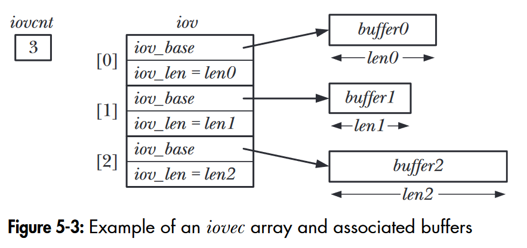

`readv()` and `writev()` facilitate *scatter-gather I/O*, enabling atomic read and write operations to/from multiple discrete buffers.


“Figure 5-3: Example of an iovec array and associated buffers” ([Kerrisk, 2010, p. 100](zotero://select/library/items/CW77TP4Y)) ([pdf](zotero://open-pdf/library/items/P9T2JPZU?page=144&annotation=7S3XTG3D))

The `truncate()` and `ftruncate()` system calls allow us to *truncate* or extend a file, resulting in excess data loss or causing file holes. Similar operations exist in databases, such as truncating tables.

*Nonblocking I/O* is achieved by passing `O_NONBLOCK` (or in some outdated System V implementations, `O_NDELAY`) to the `open()` system call, or by modifying the flags of a file descriptor using `fcntl()` (for file descriptors that cannot be obtained using `open()`). The kernel provides buffer support for reading and writing regular files, meaning operations on regular files often won't be blocked. Using Nonblocking I/O on such files is also meaningful as it allows bypassing mandatory lock constraints.

The operating system maintains the `/dev/fd` directory for each process to store open file descriptors visible to that process, represented as symbolic links. Symbolic links in this directory are often used for *user-level command operations* (e.g., `ls | diff /dev/fd/0 oldfilelist`) rather than directly for programming.

```bash
root@IVT-WKS-000223:~# cd /dev/fd
root@IVT-WKS-000223:/dev/fd# ll
total 0
dr-x------ 2 root root  0 Mar 22 11:19 ./
dr-xr-xr-x 9 root root  0 Mar 22 11:19 ../
lrwx------ 1 root root 64 Mar 22 11:19 0 -> /dev/pts/7
lrwx------ 1 root root 64 Mar 22 11:19 1 -> /dev/pts/7
lrwx------ 1 root root 64 Mar 22 11:19 2 -> /dev/pts/7
lrwx------ 1 root root 64 Mar 22 11:19 255 -> /dev/pts/7
lrwx------ 1 root root 64 Mar 22 11:19 4 -> /dev/ptmx
root@IVT-WKS-000223:/dev/fd# ls
0  1  2  255  4
root@IVT-WKS-000223:/dev/fd# echo "hello" >> ./1
hello
```

The operating system provides `mkstemp()` and `tmpfile()` APIs for creating *temporary files*. The former often uses `unlink()` to destroy files (which also requires using `close()` to completely eliminate them), while the latter automatically calls `unlink()` when closed. Compilers often create numerous temporary files during compilation, utilizing these system calls for such operations.

---

`readv()`和`writev()`可以实现*scatter-gather I/O*。它允许我们向/从多个离散的buffer进行原子的读写操作。

<!--  -->

`truncate()`和`ftruncate()`系统调用允许我们截断*excess data is lost*或者extend某个文件，这也是造成*file hole*的原因。类似效果的操作在数据库中也存在，比如对表的截断。

*Nonblocking IO*通过在`open()`系统调用中传入`O_NONBLOCK`（某些过时的System V会支持`O_NDELAY`）实现，或者通过`fcntl()`对文件描述符的*flag*进行修改（某些文件描述符无法使用`open()`获得）。内核对regular file的读写提供buffer支持，这意味着对regular file的读写往往不会被阻塞。对这类文件使用Nonblocking IO同样有意义，因为能让我们越过*mandatory lock*的约束。

操作系统为每个进程维护了`/dev/fd`文件夹用以存储该进程可见的打开文件描述符，这些描述符是符号链接`symbolic link`。该目录下的符号链接往往被用于进行一些*user-level command*的操作（比如`ls | diff /dev/fd/0 oldfilelist`），而不是直接用于编写程序。

<!-- ```bash
root@IVT-WKS-000223:~# cd /dev/fd
root@IVT-WKS-000223:/dev/fd# ll
total 0
dr-x------ 2 root root  0 Mar 22 11:19 ./
dr-xr-xr-x 9 root root  0 Mar 22 11:19 ../
lrwx------ 1 root root 64 Mar 22 11:19 0 -> /dev/pts/7
lrwx------ 1 root root 64 Mar 22 11:19 1 -> /dev/pts/7
lrwx------ 1 root root 64 Mar 22 11:19 2 -> /dev/pts/7
lrwx------ 1 root root 64 Mar 22 11:19 255 -> /dev/pts/7
lrwx------ 1 root root 64 Mar 22 11:19 4 -> /dev/ptmx
root@IVT-WKS-000223:/dev/fd# ls
0  1  2  255  4
root@IVT-WKS-000223:/dev/fd# echo "hello" >> ./1
hello
``` -->

操作系统对用户提供`mkstemp()`和`tmpfile()`用于临时文件的创建api，前者往往使用`unlink()`对文件进行销毁（当然也需要使用`close()`对文件进行彻底消除），后者则会在被关闭时自动调用`unlink()`。编译器在执行编译的时候会创建大量临时文件，这些操作往往使用这两个系统调用实现。

## References

Kerrisk, Michael. The Linux Programming Interface: A Linux and UNIX System Programming Handbook. San Francisco: No Starch Press, 2010.
