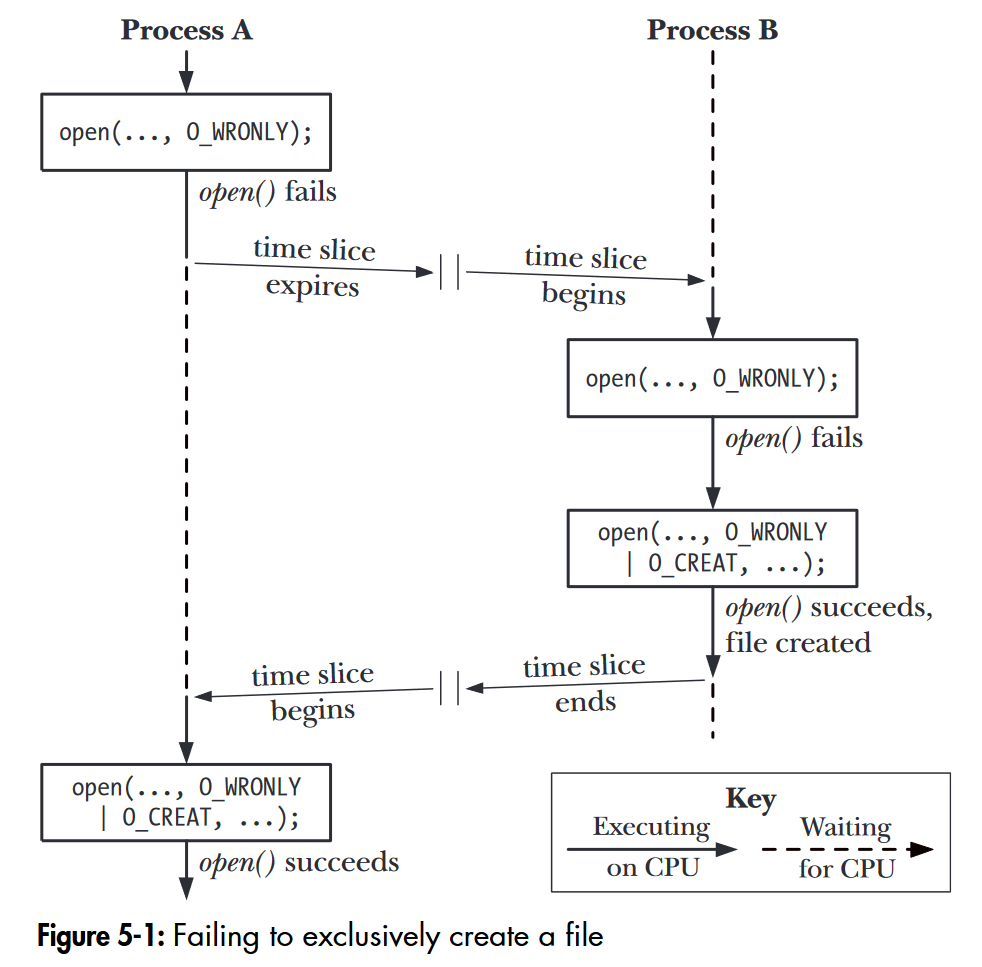
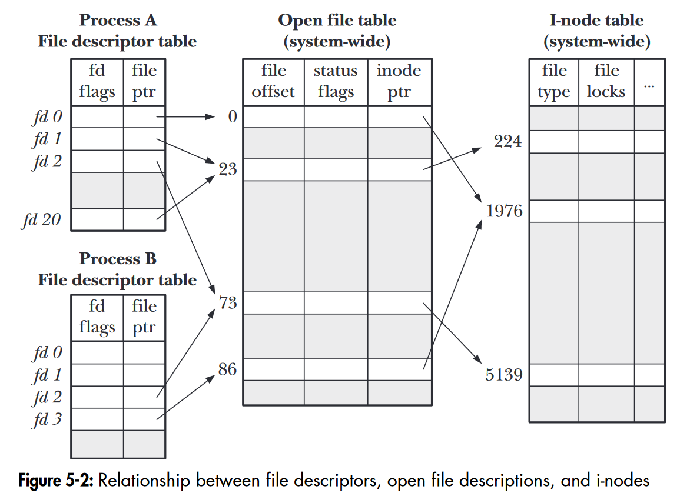

The *atomicity* of a *system call* is crucial as it is a prerequisite for the correct execution of system calls. The term *race Condition* implies that the outcome of concurrent program execution depends on the scheduling order of processors. Robust programs should avoid race conditions. Two examples of race condition: checking if a file exists - creating a file; multiple processes (threads) concurrently writing to the same file.

When using the `open()` system call to create a file, using `O_CREAT | O_EXCL` can make checking if the file exists and file creation an atomic operation. Concurrent writes using `lseek()` + `write()` implementation can lead to a race condition because these two operations are not atomic and should be replaced with `write()` with `O_APPEND` flag. Using `pwrite()` and `pread()` is also a good approach; these two IO operations are atomic and reset the file offset to its value before the call, with less overhead than resetting the offset after `write()` using `lseek()`, making them a good tool for concurrent programming.

<!-- {{ $image := .Resources.Get "image.png" }} -->

`fcntl()` system call is used to modify the state of an open file descriptor and is useful in the following two cases: 1. The creator of the file descriptor is not the caller. 2. It is not a file descriptor returned by the `open()` system call (such as a *socket*).

The relationship between file descriptors and *i-nodes* is described by three tables of the OS: *Per-process file descriptor table*, *System-wide open file descriptors table*, *File system i-node table*. The *i-node* table stores different information in memory and on non-volatile disk.

<!-- {{ $image := .Resources.Get "image-1.png" }} -->

When a file is opened twice by the same process or opened by different processes, using *dup()*, *fork()*, and other system calls can lead to shared records or shared *i-node* table entries, and sharing of the *open file table* results in shared offsets. Changes in *open file status flags* are also related to it.

---

*System call*的原子性是重要的，他是系统调用被正确执行的先决条件。*Race Condition*的含义是并发程序的执行结果取决于处理器的调度顺序。健壮的程序应该避免*Race condition*。*Race condition*的两个例子：检测文件是否存在-创建文件；多进程（线程）通过设置偏移量并发写同一个文件。

在使用`open()`系统调用创建文件的时候，使用`O_CREAT | O_EXCL`能将检查文件是否存在和文件创建变成一个原子操作。并发写使用`lseek()`+`write()`实现会造成race condition，因为这两个操作不是原子的，需要替换成`write()` with `O_APPEND` *flag*。使用`pwrite()`以及`pread()`也是一个好方法，这两个IO操作是原子的，且在完成后会把文件偏移量重置为调用前的值，其时间开销比`write()`后用`lseek()`重置*offset*小，是并发编程的好帮手。

`fcntl()`系统调用用于修改打开文件描述符的状态，在以下两种情况下很有用：1    . 该文件描述符的创建者不是caller。2. 不是由`open()`系统调用返回的文件描述符（比如*socket*）。

文件描述符与*i-node*之间的关系由OS的三种表描述：*Per-process file descriptor table*，*System-wide open file descriptors table*，*File system i-node table*。其中*i-node*表在内存和*non volatile*磁盘上分别存储着不同的信息。

同一个进程打开两次某个文件，或者不同进程打开同一个文件，使用*dup()*，*fork()* 等系统调用都会造成记录的共享或*i-node*表项的共享，*open file table*的共享会造成*offset*的共享。*open file status flag*的改变也和它有关。

## References

Kerrisk, Michael. The Linux Programming Interface: A Linux and UNIX System Programming Handbook. San Francisco: No Starch Press, 2010.
