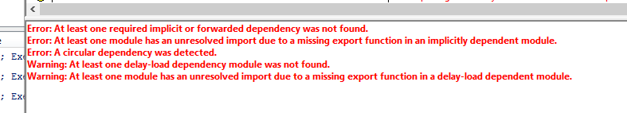

### 工具选择

[Linux平台下的工具选择](https://opensource.com/article/20/4/linux-binary-analysis)

### Static Analysis

> In addition, applications can also load further resources at runtime, which means that it isn't possible to know all of the application's dependencies without executing it.[1]

最好使用exe文件来进行依赖分析，直接分析库的话好像不是特别好

依赖常见错误是，使用了名字相同但是路径不同的库，这会造成依赖错误，而dependencies以及dependency walker可以查看库的绝对路径，这方便了程序员检查。

[dependency walker](https://kb.froglogic.com/misc/using-dependency-walker/#detecting-the-compiler)的一个优点是可以做静态查错，但是这会让他的运行非常慢，消耗巨大的CPU资源，并不好用：

dependency walker可以保存依赖，传播给别人进行研究，但是dependencies不行
> Now search for "\[+E" to locate the failed imports (they are prefixed with "\[+E"):

Pat在我做onboard项目的时候解决编译时错误：找不到库的下意识反应是我的VS没有安装工具包，这个思路是对的。

> For a Debug build of a Qt application a Debug build of the Squish for Qt package is required. (Please request Debug build packages of Squish for Qt from our technical support.)

一般Debug输出的App依赖Debug的库

### Detecting the compiler

事实上不同的MSVC编译器会绑定不同版本的DLL库，所以静态分析的时候可以通过可执行程序使用的不同版本的依赖反推出使用的编译器版本。

### Runtime Analysis

## References